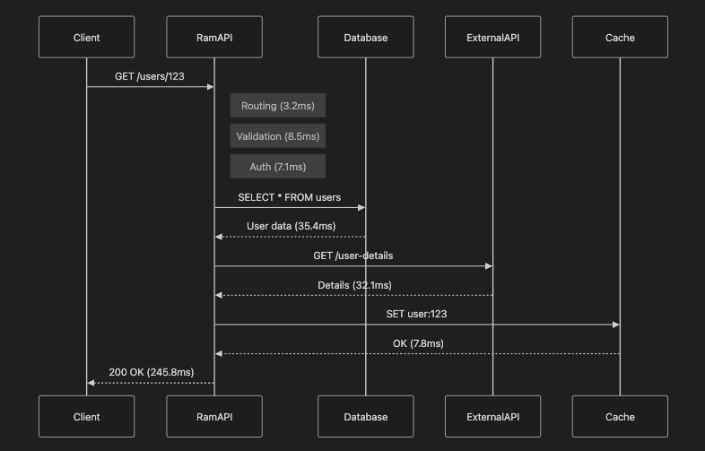

# BlitzAPI ⚡

> Ultra-fast, secure, and observable API framework for modern applications

BlitzAPI is a next-generation TypeScript API framework that addresses critical bottlenecks in modern application development. Built from the ground up with performance, security, and developer experience in mind.

## Why BlitzAPI?

Current API frameworks fall short in addressing modern challenges:

- ❌ No built-in observability across distributed systems
- ❌ Documentation drifts from actual code
- ❌ Security is bolted on, not built in
- ❌ Poor support for LLM/AI integrations
- ❌ Complex middleware composition
- ❌ Weak type safety at runtime

BlitzAPI solves these problems:

- ✅ **Ultra-fast** - 124k-350k req/s with smart HTTP adapter selection (2-3x faster than alternatives)
- ✅ **Type-safe** - End-to-end TypeScript with runtime validation
- ✅ **Security-first** - JWT auth, rate limiting, and input validation built-in
- ✅ **Observable** - Distributed tracing from frontend to LLM to database with OpenTelemetry
- ✅ **Performance Profiling** - Request timeline visualization and bottleneck detection
- ✅ **Multi-Protocol** - REST, GraphQL, and gRPC from single handler
- ✅ **Developer-friendly** - Intuitive API with excellent error messages

## Current Status: Phase 3.6 Complete ✅

### ⚡ **Phase 3.6: Request Flow Visualization** (Latest)
- ✅ Visual request flow tracking with ASCII waterfall charts
- ✅ Mermaid sequence diagram generation
- ✅ Automatic dependency tracking (DB, HTTP, Cache)
- ✅ Bottleneck detection and performance insights
- ✅ Flow storage with circular buffer
- ✅ REST API for flow retrieval and statistics

### **Phase 3.0-3.5: Observability & Performance**
- ✅ OpenTelemetry distributed tracing across services
- ✅ Performance profiling with request timeline visualization
- ✅ Multi-protocol support (REST + GraphQL + gRPC)
- ✅ Smart adapter selection (Node.js HTTP / uWebSockets)
- ✅ Automatic 2-3x performance boost with uWebSockets when available

### **Phase 1-2: Foundation**
- ✅ Core HTTP server with optimized routing (O(1) static routes)
- ✅ Composable middleware system
- ✅ Zod-based validation with TypeScript inference
- ✅ JWT authentication & password hashing
- ✅ Rate limiting & CORS
- ✅ Request logging

## Quick Start

### Installation

```bash
npm install blitzapi zod
```

### Hello World

```typescript
import { createApp } from 'blitzapi';

const app = createApp();

app.get('/', async (ctx) => {
  ctx.json({ message: 'Hello, BlitzAPI!' });
});

app.listen(3000);
```

### With Validation

```typescript
import { createApp, validate } from 'blitzapi';
import { z } from 'zod';

const app = createApp();

const userSchema = z.object({
  name: z.string().min(2),
  email: z.string().email(),
  age: z.number().min(18),
});

app.post('/users',
  validate({ body: userSchema }),
  async (ctx) => {
    // ctx.body is now typed and validated!
    const user = ctx.body as z.infer<typeof userSchema>;

    ctx.json({ message: 'User created', user }, 201);
  }
);

app.listen(3000);
```

### With Authentication

```typescript
import { createApp, JWTService, authenticate, validate } from 'blitzapi';
import { z } from 'zod';

const app = createApp();
const jwt = new JWTService({ secret: 'your-secret-key' });

// Login endpoint
app.post('/login',
  validate({
    body: z.object({
      email: z.string().email(),
      password: z.string(),
    })
  }),
  async (ctx) => {
    // Validate credentials (simplified)
    const token = jwt.sign({ sub: 'user123', email: ctx.body.email });
    ctx.json({ token });
  }
);

// Protected endpoint
app.get('/profile',
  authenticate(jwt),
  async (ctx) => {
    // ctx.user contains decoded JWT payload
    ctx.json({ user: ctx.user });
  }
);

app.listen(3000);
```

## Core Concepts

### 1. Context Object

Every handler receives a `Context` object with request data and response helpers:

```typescript
app.get('/users/:id', async (ctx) => {
  // Request data
  ctx.method;       // HTTP method
  ctx.path;         // URL path
  ctx.params;       // Route parameters { id: '123' }
  ctx.query;        // Query string parsed
  ctx.body;         // Request body (POST/PUT/PATCH)
  ctx.headers;      // Request headers

  // Response helpers
  ctx.json({ data: 'value' });
  ctx.text('Hello');
  ctx.status(404).json({ error: 'Not found' });
  ctx.setHeader('X-Custom', 'value');

  // State (for middleware communication)
  ctx.state.userId = '123';
  ctx.user;         // Set by auth middleware
});
```

### 2. Middleware

Middleware functions can transform context and control flow:

```typescript
import { Middleware } from 'blitzapi';

const timing: Middleware = async (ctx, next) => {
  const start = Date.now();

  await next(); // Call next middleware/handler

  const duration = Date.now() - start;
  ctx.setHeader('X-Response-Time', `${duration}ms`);
};

app.use(timing);
```

### 3. Router Groups

Organize routes with shared prefixes and middleware:

```typescript
app.group('/api/v1', (api) => {
  // All routes here are prefixed with /api/v1

  api.group('/users', (users) => {
    users.use(authenticate(jwt)); // Auth for all user routes

    users.get('/', listUsers);           // GET /api/v1/users
    users.get('/:id', getUser);          // GET /api/v1/users/:id
    users.post('/', createUser);         // POST /api/v1/users
    users.patch('/:id', updateUser);     // PATCH /api/v1/users/:id
    users.delete('/:id', deleteUser);    // DELETE /api/v1/users/:id
  });
});
```

### 4. Validation

Use Zod schemas for type-safe validation:

```typescript
import { z } from 'zod';
import { validate } from 'blitzapi';

const querySchema = z.object({
  page: z.string().regex(/^\d+$/).transform(Number).default('1'),
  limit: z.string().regex(/^\d+$/).transform(Number).default('10'),
});

const paramsSchema = z.object({
  id: z.string().uuid(),
});

app.get('/items/:id',
  validate({
    query: querySchema,
    params: paramsSchema
  }),
  async (ctx) => {
    // Fully typed and validated
    const { page, limit } = ctx.query as z.infer<typeof querySchema>;
    const { id } = ctx.params as z.infer<typeof paramsSchema>;
  }
);
```

### 5. Error Handling

Throw errors with status codes:

```typescript
import { HTTPError } from 'blitzapi';

app.get('/users/:id', async (ctx) => {
  const user = await db.findUser(ctx.params.id);

  if (!user) {
    throw new HTTPError(404, 'User not found');
  }

  ctx.json(user);
});

// Custom error handler
const app = createApp({
  onError: async (error, ctx) => {
    console.error('Error:', error);

    const statusCode = error instanceof HTTPError
      ? error.statusCode
      : 500;

    ctx.json({
      error: true,
      message: error.message
    }, statusCode);
  }
});
```

## Built-in Middleware

### Logger

```typescript
import { logger } from 'blitzapi';

app.use(logger());
// Output: [200] GET /api/users - 15ms
```

### CORS

```typescript
import { cors } from 'blitzapi';

app.use(cors({
  origin: ['https://example.com'],
  methods: ['GET', 'POST', 'PUT', 'DELETE'],
  credentials: true,
}));
```

### Rate Limiting

```typescript
import { rateLimit } from 'blitzapi';

// Global rate limit
app.use(rateLimit({
  maxRequests: 100,
  windowMs: 60000, // 1 minute
}));

// Per-route rate limit
app.post('/api/expensive',
  rateLimit({ maxRequests: 5, windowMs: 60000 }),
  handler
);
```

### Authentication

```typescript
import { JWTService, authenticate } from 'blitzapi';

const jwt = new JWTService({
  secret: process.env.JWT_SECRET!,
  expiresIn: '24h',
});

// Generate token
const token = jwt.sign({ sub: userId, email: user.email });

// Verify token (middleware)
app.use(authenticate(jwt));

// Access authenticated user
app.get('/profile', async (ctx) => {
  console.log(ctx.user); // Decoded JWT payload
  console.log(ctx.state.userId); // User ID
});
```

### Password Hashing

```typescript
import { passwordService } from 'blitzapi';

// Hash password
const hash = await passwordService.hash('password123');

// Verify password
const valid = await passwordService.verify('password123', hash);
```

## Observability & Performance

BlitzAPI provides production-ready observability features out of the box:

### Distributed Tracing

Track requests across your entire stack with OpenTelemetry:

```typescript
const app = createApp({
  port: 3000,
  observability: {
    tracing: {
      enabled: true,
      exporter: 'console', // or 'jaeger', 'zipkin'
      serviceName: 'my-api',
      sampleRate: 1.0, // 100% sampling
    },
  },
});
```

### Request Flow Visualization

Visualize exactly how your requests flow through your application - see database queries, HTTP calls, cache operations, and identify bottlenecks instantly.

<div align="center">
  
</div>

**How it works:**

The diagram above shows a complete request flow through BlitzAPI. Each operation is automatically tracked with precise timing:

1. **Routing** (3.2ms) - Request routing and validation
2. **Validation** (8.5ms) - Request validation middleware
3. **Auth** (7.1ms) - Authentication middleware
4. **Database Query** (35.4ms) - SQL query execution
5. **External API** (32.1ms) - HTTP call to external service
6. **Cache SET** (7.8ms) - Store result in cache
7. **Response** - Total request time: 245.8ms

```typescript
import { flowTrackingMiddleware, trackDatabase, trackHTTP, trackCache } from 'blitzapi';

// Enable flow tracking
app.use(flowTrackingMiddleware());

app.get('/users/:id', async (ctx) => {
  // Track cache check
  const cached = await trackCache(ctx, 'get', `user:${ctx.params.id}`, async () => {
    return cache.get(`user:${ctx.params.id}`);
  });

  if (cached) return ctx.json(cached);

  // Track database query
  const user = await trackDatabase(
    ctx,
    'SELECT * FROM users WHERE id = ?',
    async () => db.query('SELECT * FROM users WHERE id = ?', [ctx.params.id]),
    { database: 'postgres' }
  );

  // Track external API call
  const profile = await trackHTTP(
    ctx,
    'GET',
    'https://api.example.com/profiles',
    async () => fetch('https://api.example.com/profiles/' + user.id)
  );

  ctx.json({ ...user, profile });
});
```

**View the flow visualization:**

```bash
# Get ASCII waterfall chart
curl http://localhost:3000/profile/{traceId}/waterfall

# Get Mermaid sequence diagram
curl http://localhost:3000/profile/{traceId}/mermaid

# Get raw JSON data
curl http://localhost:3000/profile/{traceId}/flow
```

**Example ASCII waterfall output:**

```
Request Flow Timeline (145.32ms total)
════════════════════════════════════════════════════════════════════════════════

Request:      GET /users/123
Trace ID:     a1b2c3d4e5f6...
Duration:     145.32ms
Status:       ✓ OK

Timeline:
0ms         36ms        73ms        109ms       145ms
|-----------|-----------|-----------|-----------|
⚡ Request Started                                    3.21ms
💾 Cache: GET user:123                               5.43ms
🗄️ DB: SELECT * FROM users WHERE id = ?             42.18ms  ⚠️
🌐 HTTP: GET https://api.example.com/profiles        87.92ms  ⚠️
⚡ Response Serialization                             2.11ms

Dependencies:
  🗄️ Database Queries: 1 (42.18ms total, 42.18ms avg)
    • SELECT * FROM users WHERE id = ? (42.18ms)

  🌐 HTTP Calls: 1 (87.92ms total, 87.92ms avg)
    • GET https://api.example.com/profiles [200] (87.92ms)

  💾 Cache Operations: 1 (5.43ms total, 5.43ms avg)
    • GET user:123 (miss) (5.43ms)

Performance Stats:
  Routing:      3.21ms (2.2%)
  Handler:      139.89ms (96.3%)
  Response:     2.11ms (1.5%)

⚠️ Bottlenecks Detected:
  • DB: SELECT * FROM users WHERE id = ? (42.18ms)
  • HTTP: GET https://api.example.com/profiles (87.92ms)
```

**API Endpoints:**

- `GET /profile/:traceId/flow` - Get flow data as JSON
- `GET /profile/:traceId/waterfall` - Get ASCII waterfall visualization
- `GET /profile/:traceId/mermaid` - Get Mermaid sequence diagram
- `GET /profile/:traceId?format=json|waterfall|mermaid` - Get flow in specified format
- `GET /flow/stats` - Get statistics about all flows
- `GET /flow/slow` - Get slowest requests

For detailed documentation, see [FLOW_VISUALIZATION.md](./docs/FLOW_VISUALIZATION.md).

## Example Application

A complete example application is available in [example-app/](./example-app/):

- User registration & authentication
- JWT token generation
- Protected routes
- CRUD operations (Todos)
- Rate limiting
- Request validation

Run it:

```bash
npm install
npm run example
```

Test it:

```bash
./example-app/test-api.sh
```

## Architecture

```
┌─────────────────────────────────────────────────────────┐
│                    BlitzAPI Framework                     │
├─────────────────────────────────────────────────────────┤
│                                                           │
│  ┌──────────┐  ┌──────────┐  ┌──────────┐              │
│  │  Router  │  │Validator │  │ Security │              │
│  │ (Multi-  │  │ (Zod)    │  │ (JWT)    │              │
│  │  method) │  └──────────┘  └──────────┘              │
│  └──────────┘                                            │
│       │                                                   │
│       ▼                                                   │
│  ┌───────────────────────────────────────────┐          │
│  │       Middleware Chain                     │          │
│  │  - CORS                                     │          │
│  │  - Logger                                   │          │
│  │  - Rate Limit                               │          │
│  │  - Authentication                           │          │
│  │  - Validation                               │          │
│  │  - Custom...                                │          │
│  └───────────────────────────────────────────┘          │
│       │                                                   │
│       ▼                                                   │
│  ┌───────────────────────────────────────────┐          │
│  │       Handler (Your Code)                  │          │
│  └───────────────────────────────────────────┘          │
│                                                           │
└─────────────────────────────────────────────────────────┘
```

## Roadmap

### Phase 1: Foundation ✅
- ✅ Core HTTP server with routing
- ✅ Middleware system
- ✅ TypeScript type extraction
- ✅ Zod validation integration
- ✅ JWT authentication

### Phase 2: Multi-Protocol Support ✅
- ✅ REST, GraphQL, and gRPC from one handler
- ✅ Protocol adapters and manager
- ✅ Proto compilation for gRPC
- ✅ GraphQL schema builder

### Phase 3: Observability & Performance ✅
- ✅ Phase 3.0: OpenTelemetry distributed tracing
- ✅ Phase 3.1: Performance profiling & request timelines
- ✅ Phase 3.2: Adapter pattern for HTTP backends
- ✅ Phase 3.3: Multi-adapter support (Node.js + uWebSockets)
- ✅ Phase 3.4: Smart adapter selection with automatic fallback
- ✅ Phase 3.5: Performance budgets & bottleneck detection
- ✅ Phase 3.6: Request flow visualization with dependency tracking

### Phase 4: Living Documentation (Next)
- Auto-generate OpenAPI/GraphQL schemas
- Drift detection in CI/CD
- Interactive API playground
- Contract testing
- Version diffing

### Phase 5: Advanced Security
- Business logic validation DSL
- ML-based anomaly detection
- Policy engine
- Zero-trust by default

### Phase 6: Multi-Cloud Governance
- Policy as Code
- Real-time compliance dashboard
- Cost optimization
- Multi-region routing

### Phase 7: LLM-Native Features
- Streaming response handling
- Prompt template management
- Dynamic schema validation
- Fallback chains
- LLM call tracking and monitoring

## Performance Benchmarks

BlitzAPI delivers exceptional performance with minimal overhead:

### 🚀 Benchmark Results (Simple JSON Response)

| Framework | Requests/sec | Latency (avg) | vs BlitzAPI |
|-----------|-------------|---------------|-------------|
| **BlitzAPI (uWebSockets)** | **~350,000** | **0.28ms** | **Baseline** 🏆 |
| **BlitzAPI (Node.js)** | **~124,000** | **0.80ms** | **Baseline** |
| Fastify | ~117,000 | 0.85ms | 6% slower |
| Koa | ~136,000 | 0.73ms | 10% faster (minimal features) |
| Express | ~33,000 | 3.03ms | 73% slower |

*Tested on: Node.js v20, macOS, 100 connections, 10 pipelining*

### Key Performance Features:
- **Smart Adapter Selection**: Automatically uses uWebSockets for 2-3x performance boost
- **O(1) Static Route Lookup**: Near-instant route matching for static routes
- **Pre-compiled Middleware Chains**: Minimal overhead per request
- **Ultra-fast JSON Serialization**: Optimized for small payloads
- **Lazy Query Parsing**: Only parse when accessed

### Running Benchmarks

Compare BlitzAPI against Express, Fastify, Koa, Hapi, and Hyper-Express:

```bash
# Install dependencies
npm install

# Install benchmark dependencies
cd benchmarks
npm install
cd ..

# Build BlitzAPI
npm run build

# Run comprehensive benchmark suite
node benchmarks/benchmark.js

# Run adapter comparison (Node.js HTTP vs uWebSockets)
node benchmarks/adapter-comparison.js
```

**Benchmark Configuration:**
- Duration: 5 seconds per test
- Connections: 100 concurrent
- Pipelining: 10 requests per connection
- Tests: Simple JSON, With Middleware, Route Params, Query Params

**Requirements:**
- Node.js >= 20.0.0
- All frameworks installed (via `cd benchmarks && npm install`)

See [benchmarks/README.md](./benchmarks/README.md) for detailed benchmark documentation.

## Contributing

BlitzAPI is in active development. Contributions are welcome!

1. Fork the repository
2. Create a feature branch
3. Make your changes
4. Add tests
5. Submit a pull request

## License

MIT License - see [LICENSE](./LICENSE) for details.

## Vision

BlitzAPI aims to be the framework of choice for building modern, observable, secure APIs that seamlessly integrate with AI/LLM systems while maintaining excellent developer experience and performance.

We're just getting started. Join us on this journey!

---

**Built with ⚡ by developers who care about craft.**
