# Request Flow Visualization

> Visual request flow tracking with automatic dependency detection and bottleneck identification

## Overview

RamAPI's Flow Visualization feature provides deep insights into how your requests flow through your application. It automatically tracks:

- **Lifecycle Events**: Routing, handler execution, response serialization
- **Database Queries**: SQL queries with duration and metadata
- **HTTP Calls**: External API calls with status codes and timing
- **Cache Operations**: Get/set/delete operations with hit/miss tracking
- **Bottlenecks**: Automatic detection of slow operations (>100ms)

## Table of Contents

1. [Quick Start](#quick-start)
2. [Core Concepts](#core-concepts)
3. [Tracking Dependencies](#tracking-dependencies)
4. [Visualization Formats](#visualization-formats)
5. [API Endpoints](#api-endpoints)
6. [Configuration](#configuration)
7. [Advanced Usage](#advanced-usage)
8. [Best Practices](#best-practices)

---

## Quick Start

### 1. Enable Flow Tracking

```typescript
import { createApp } from 'ramapi';
import { flowTrackingMiddleware } from 'ramapi/observability/flow';

const app = createApp({
  port: 3000,
  observability: {
    // Tracing must be enabled for flow tracking
    tracing: {
      enabled: true,
      exporter: 'console',
      serviceName: 'my-api',
    },
  },
});

// Add flow tracking middleware
app.use(flowTrackingMiddleware());
```

### 2. Track Dependencies

```typescript
import { trackDatabase, trackHTTP, trackCache } from 'ramapi/observability/flow';

app.get('/users/:id', async (ctx) => {
  // Track database query
  const user = await trackDatabase(
    ctx,
    'SELECT * FROM users WHERE id = ?',
    async () => db.query('SELECT * FROM users WHERE id = ?', [ctx.params.id]),
    { database: 'postgres' }
  );

  // Track HTTP call
  const profile = await trackHTTP(
    ctx,
    'GET',
    'https://api.example.com/profiles/' + user.id,
    async () => fetch(`https://api.example.com/profiles/${user.id}`)
  );

  ctx.json({ ...user, profile });
});
```

### 3. View Flow Visualization

After making a request, use the `traceId` from the response headers or logs:

```bash
# Get ASCII waterfall chart
curl http://localhost:3000/profile/{traceId}/waterfall

# Get Mermaid sequence diagram
curl http://localhost:3000/profile/{traceId}/mermaid

# Get raw JSON data
curl http://localhost:3000/profile/{traceId}/flow
```

---

## Core Concepts

### Flow Context

Every request creates a **flow context** that tracks:

- **Request metadata**: Method, path, trace ID
- **Lifecycle events**: Routing, handler execution, response
- **Dependencies**: Database queries, HTTP calls, cache operations
- **Performance stats**: Duration breakdowns, percentages
- **Bottlenecks**: Operations exceeding performance thresholds

### Automatic Tracking

The `flowTrackingMiddleware()` automatically captures:

- Request start/end times
- Routing duration
- Handler execution time
- Response serialization time

### Manual Tracking

Use tracking utilities to capture specific operations:

- `trackDatabase()` - Database queries
- `trackHTTP()` - HTTP/API calls
- `trackCache()` - Cache operations
- `trackOperation()` - Custom operations

---

## Tracking Dependencies

### Database Queries

Track SQL queries with full context:

```typescript
import { trackDatabase } from 'ramapi/observability/flow';

app.get('/posts', async (ctx) => {
  const posts = await trackDatabase(
    ctx,
    'SELECT * FROM posts ORDER BY created_at DESC LIMIT 10',
    async () => {
      return db.query('SELECT * FROM posts ORDER BY created_at DESC LIMIT 10');
    },
    {
      database: 'postgres',     // Database name/type
      sanitize: false,          // Sanitize sensitive data (default: false)
    }
  );

  ctx.json({ posts });
});
```

**Captured Data:**
- Query string (first 50 characters in visualization)
- Execution duration
- Database name/type
- Rows affected (if available)
- Errors (if query fails)

**Example with multiple queries:**

```typescript
app.get('/dashboard', async (ctx) => {
  // Track multiple queries in sequence
  const users = await trackDatabase(
    ctx,
    'SELECT COUNT(*) FROM users',
    async () => db.query('SELECT COUNT(*) FROM users')
  );

  const posts = await trackDatabase(
    ctx,
    'SELECT COUNT(*) FROM posts',
    async () => db.query('SELECT COUNT(*) FROM posts')
  );

  const comments = await trackDatabase(
    ctx,
    'SELECT COUNT(*) FROM comments',
    async () => db.query('SELECT COUNT(*) FROM comments')
  );

  ctx.json({ users: users[0].count, posts: posts[0].count, comments: comments[0].count });
});
```

### HTTP Calls

Track external API calls:

```typescript
import { trackHTTP } from 'ramapi/observability/flow';

app.get('/weather/:city', async (ctx) => {
  const weatherData = await trackHTTP(
    ctx,
    'GET',
    `https://api.weather.com/v1/current?city=${ctx.params.city}`,
    async () => {
      const response = await fetch(
        `https://api.weather.com/v1/current?city=${ctx.params.city}`,
        { headers: { 'Authorization': `Bearer ${API_KEY}` } }
      );
      return response.json();
    }
  );

  ctx.json(weatherData);
});
```

**Captured Data:**
- HTTP method (GET, POST, etc.)
- URL
- Duration
- Status code
- Error details (if call fails)

**Example with parallel HTTP calls:**

```typescript
app.get('/aggregate/:userId', async (ctx) => {
  // Track parallel HTTP calls
  const [profile, orders, reviews] = await Promise.all([
    trackHTTP(ctx, 'GET', 'https://api.users.com/profile', async () =>
      fetch(`https://api.users.com/profile/${ctx.params.userId}`).then(r => r.json())
    ),
    trackHTTP(ctx, 'GET', 'https://api.orders.com/user-orders', async () =>
      fetch(`https://api.orders.com/user-orders/${ctx.params.userId}`).then(r => r.json())
    ),
    trackHTTP(ctx, 'GET', 'https://api.reviews.com/user-reviews', async () =>
      fetch(`https://api.reviews.com/user-reviews/${ctx.params.userId}`).then(r => r.json())
    ),
  ]);

  ctx.json({ profile, orders, reviews });
});
```

### Cache Operations

Track cache interactions with hit/miss tracking:

```typescript
import { trackCache } from 'ramapi/observability/flow';

app.get('/products/:id', async (ctx) => {
  const cacheKey = `product:${ctx.params.id}`;

  // Track cache GET (check for cached value)
  const cached = await trackCache(ctx, 'get', cacheKey, async () => {
    return cache.get(cacheKey);
  });

  if (cached) {
    return ctx.json(cached);
  }

  // Cache miss - fetch from database
  const product = await trackDatabase(
    ctx,
    'SELECT * FROM products WHERE id = ?',
    async () => db.query('SELECT * FROM products WHERE id = ?', [ctx.params.id])
  );

  // Track cache SET (store value)
  await trackCache(ctx, 'set', cacheKey, async () => {
    return cache.set(cacheKey, product, 3600); // 1 hour TTL
  }, {
    ttl: 3600,
    captureSize: true,
  });

  ctx.json(product);
});
```

**Captured Data:**
- Operation type (get, set, delete)
- Cache key
- Duration
- Hit/miss status
- TTL (for set operations)
- Value size (if captureSize: true)

**Example with cache invalidation:**

```typescript
app.put('/products/:id', async (ctx) => {
  // Update product in database
  const product = await trackDatabase(
    ctx,
    'UPDATE products SET ... WHERE id = ?',
    async () => db.query('UPDATE products SET ... WHERE id = ?', [ctx.params.id, ...])
  );

  // Track cache DELETE (invalidate old cache)
  await trackCache(ctx, 'delete', `product:${ctx.params.id}`, async () => {
    return cache.delete(`product:${ctx.params.id}`);
  });

  ctx.json(product);
});
```

### Custom Operations

Track any custom operation:

```typescript
import { trackOperation } from 'ramapi/observability/flow';

app.post('/process', async (ctx) => {
  const result = await trackOperation(
    ctx,
    'custom',
    'Image Processing',
    async () => {
      // Your custom operation
      return await processImage(ctx.body.imageUrl);
    },
    {
      imageUrl: ctx.body.imageUrl,
      format: 'jpeg',
    }
  );

  ctx.json(result);
});
```

---

## Visualization Formats

### ASCII Waterfall Chart

Visual timeline showing all operations with colored bars:

```bash
curl http://localhost:3000/profile/{traceId}/waterfall
```

**Output:**

```
Request Flow Timeline (145.32ms total)
════════════════════════════════════════════════════════════════════════════════

Request:      GET /users/123
Trace ID:     a1b2c3d4e5f6g7h8i9j0
Duration:     145.32ms
Status:       ✓ OK

Timeline:
0ms         36ms        73ms        109ms       145ms
|-----------|-----------|-----------|-----------|
⚡ Request Started                                    3.21ms
💾 Cache: GET user:123                               5.43ms
🗄️ DB: SELECT * FROM users WHERE id = ?             42.18ms  ⚠️
🌐 HTTP: GET https://api.example.com/profiles        87.92ms  ⚠️
⚡ Response Serialization                             2.11ms

Dependencies:
  🗄️ Database Queries: 1 (42.18ms total, 42.18ms avg)
    • SELECT * FROM users WHERE id = ? (42.18ms)

  🌐 HTTP Calls: 1 (87.92ms total, 87.92ms avg)
    • GET https://api.example.com/profiles [200] (87.92ms)

  💾 Cache Operations: 1 (5.43ms total, 5.43ms avg)
    • GET user:123 (miss) (5.43ms)

Performance Stats:
  Routing:      3.21ms (2.2%)
  Handler:      139.89ms (96.3%)
  Response:     2.11ms (1.5%)

⚠️ Bottlenecks Detected:
  • DB: SELECT * FROM users WHERE id = ? (42.18ms)
  • HTTP: GET https://api.example.com/profiles (87.92ms)
```

**Features:**
- Color-coded operations (green=fast, yellow=moderate, red=slow)
- Visual timeline bars showing relative timing
- Automatic bottleneck detection (>100ms)
- Performance statistics with percentages
- Icons for different operation types

**Compact Format:**

```bash
curl http://localhost:3000/profile/{traceId}/waterfall?format=compact
```

Shorter version without detailed dependency breakdown.

### Mermaid Sequence Diagram

Generate diagrams for documentation:

```bash
curl http://localhost:3000/profile/{traceId}/mermaid
```

**Output:**



```mermaid
sequenceDiagram
    participant Client
    participant API
    participant Cache
    participant Database
    participant ExternalAPI

    Note over Client,API: GET /users/123
    Client->>+API: Request Started (0ms)

    API->>+Cache: GET user:123
    Note right of Cache: 5.43ms
    Cache-->>-API: miss

    API->>+Database: SELECT * FROM users WHERE id = ?
    Note right of Database: 42.18ms ⚠️ BOTTLENECK
    Database-->>-API: result

    API->>+ExternalAPI: GET https://api.example.com/profiles
    Note right of ExternalAPI: 87.92ms ⚠️ BOTTLENECK
    ExternalAPI-->>-API: 200 OK

    Note over API: Response Serialization (2.11ms)
    API-->>-Client: 200 OK (145.32ms total)
```

**Rendered Diagram:**

```
┌────────┐   ┌─────┐   ┌───────┐   ┌──────────┐   ┌─────────────┐
│ Client │   │ API │   │ Cache │   │ Database │   │ ExternalAPI │
└───┬────┘   └──┬──┘   └───┬───┘   └────┬─────┘   └──────┬──────┘
    │           │          │            │                 │
    │ Request   │          │            │                 │
    ├──────────>│          │            │                 │
    │           │          │            │                 │
    │           │ GET      │            │                 │
    │           ├─────────>│            │                 │
    │           │          │            │                 │
    │           │<─────────┤            │                 │
    │           │   miss   │            │                 │
    │           │          │            │                 │
    │           │ SELECT * FROM users   │                 │
    │           ├──────────────────────>│                 │
    │           │          │   42.18ms  │                 │
    │           │<──────────────────────┤                 │
    │           │          │            │                 │
    │           │ GET https://api.example.com/profiles    │
    │           ├────────────────────────────────────────>│
    │           │          │            │        87.92ms  │
    │           │<────────────────────────────────────────┤
    │           │          │            │                 │
    │ 200 OK    │          │            │                 │
    │<──────────┤          │            │                 │
```

**Markdown Format:**

```bash
curl http://localhost:3000/profile/{traceId}/mermaid?format=markdown
```

Returns the Mermaid diagram wrapped in markdown code blocks, ready for documentation.

**Compact Format:**

```bash
curl http://localhost:3000/profile/{traceId}/mermaid?format=compact
```

Simplified diagram without timing annotations.

### JSON Format

Raw flow data for programmatic access:

```bash
curl http://localhost:3000/profile/{traceId}/flow
```

**Output:**

```json
{
  "traceId": "a1b2c3d4e5f6g7h8i9j0",
  "spanId": "1234567890abcdef",
  "operationName": "GET /users/123",
  "method": "GET",
  "path": "/users/123",
  "startTime": 1234567890123.45,
  "endTime": 1234567890268.77,
  "duration": 145.32,
  "events": [
    {
      "id": "evt_001",
      "type": "lifecycle",
      "name": "Request Started",
      "status": "completed",
      "startTime": 1234567890123.45,
      "endTime": 1234567890126.66,
      "duration": 3.21,
      "metadata": {}
    },
    {
      "id": "evt_002",
      "type": "cache",
      "name": "Cache: GET user:123",
      "status": "completed",
      "startTime": 1234567890126.66,
      "endTime": 1234567890132.09,
      "duration": 5.43,
      "metadata": {
        "operation": "get",
        "key": "user:123",
        "hit": false
      }
    },
    {
      "id": "evt_003",
      "type": "database",
      "name": "DB: SELECT * FROM users WHERE id = ?",
      "status": "completed",
      "startTime": 1234567890132.09,
      "endTime": 1234567890174.27,
      "duration": 42.18,
      "metadata": {
        "query": "SELECT * FROM users WHERE id = ?",
        "database": "postgres"
      }
    },
    {
      "id": "evt_004",
      "type": "http",
      "name": "HTTP: GET https://api.example.com/profiles",
      "status": "completed",
      "startTime": 1234567890174.27,
      "endTime": 1234567890262.19,
      "duration": 87.92,
      "metadata": {
        "method": "GET",
        "url": "https://api.example.com/profiles/123",
        "statusCode": 200
      }
    },
    {
      "id": "evt_005",
      "type": "lifecycle",
      "name": "Response Serialization",
      "status": "completed",
      "startTime": 1234567890262.19,
      "endTime": 1234567890264.30,
      "duration": 2.11,
      "metadata": {
        "statusCode": 200,
        "contentType": "application/json"
      }
    }
  ],
  "dependencies": {
    "database": [
      {
        "id": "db_001",
        "query": "SELECT * FROM users WHERE id = ?",
        "duration": 42.18,
        "startTime": 1234567890132.09,
        "endTime": 1234567890174.27,
        "database": "postgres"
      }
    ],
    "http": [
      {
        "id": "http_001",
        "method": "GET",
        "url": "https://api.example.com/profiles/123",
        "duration": 87.92,
        "startTime": 1234567890174.27,
        "endTime": 1234567890262.19,
        "statusCode": 200
      }
    ],
    "cache": [
      {
        "id": "cache_001",
        "operation": "get",
        "key": "user:123",
        "duration": 5.43,
        "startTime": 1234567890126.66,
        "endTime": 1234567890132.09,
        "hit": false
      }
    ]
  },
  "stats": {
    "totalEvents": 5,
    "databaseCalls": 1,
    "httpCalls": 1,
    "cacheOperations": 1,
    "totalDatabaseTime": 42.18,
    "totalHTTPTime": 87.92,
    "totalCacheTime": 5.43,
    "totalDuration": 145.32,
    "routingDuration": 3.21,
    "handlerDuration": 139.89,
    "responseDuration": 2.11,
    "routingPercentage": 2.2,
    "handlerPercentage": 96.3,
    "responsePercentage": 1.5
  },
  "slow": false,
  "bottlenecks": [
    "DB: SELECT * FROM users WHERE id = ? (42.18ms)",
    "HTTP: GET https://api.example.com/profiles (87.92ms)"
  ]
}
```

---

## API Endpoints

### Get Flow Data

**`GET /profile/:traceId/flow`**

Get complete flow data as JSON.

**Parameters:**
- `traceId` (path) - Trace ID of the request

**Response:** JSON object with complete flow data

**Example:**

```bash
curl http://localhost:3000/profile/a1b2c3d4e5f6/flow
```

---

### Get Waterfall Visualization

**`GET /profile/:traceId/waterfall`**

Get ASCII waterfall chart.

**Parameters:**
- `traceId` (path) - Trace ID of the request
- `format` (query) - Format type: `full` (default) or `compact`
- `width` (query) - Chart width in characters (default: 80)

**Response:** Plain text waterfall chart

**Examples:**

```bash
# Full waterfall
curl http://localhost:3000/profile/a1b2c3d4e5f6/waterfall

# Compact waterfall
curl http://localhost:3000/profile/a1b2c3d4e5f6/waterfall?format=compact

# Custom width
curl http://localhost:3000/profile/a1b2c3d4e5f6/waterfall?width=120
```

---

### Get Mermaid Diagram

**`GET /profile/:traceId/mermaid`**

Get Mermaid sequence diagram.

**Parameters:**
- `traceId` (path) - Trace ID of the request
- `format` (query) - Format type: `full` (default), `compact`, or `markdown`

**Response:** Plain text Mermaid diagram

**Examples:**

```bash
# Full diagram
curl http://localhost:3000/profile/a1b2c3d4e5f6/mermaid

# Compact diagram
curl http://localhost:3000/profile/a1b2c3d4e5f6/mermaid?format=compact

# Markdown-wrapped diagram
curl http://localhost:3000/profile/a1b2c3d4e5f6/mermaid?format=markdown
```

---

### Get Flow with Format Parameter

**`GET /profile/:traceId?format=json|waterfall|mermaid`**

Unified endpoint supporting multiple formats.

**Parameters:**
- `traceId` (path) - Trace ID of the request
- `format` (query) - Output format: `json`, `waterfall`, or `mermaid`

**Examples:**

```bash
# JSON format
curl http://localhost:3000/profile/a1b2c3d4e5f6?format=json

# Waterfall format
curl http://localhost:3000/profile/a1b2c3d4e5f6?format=waterfall

# Mermaid format
curl http://localhost:3000/profile/a1b2c3d4e5f6?format=mermaid
```

---

### Get Flow Statistics

**`GET /flow/stats`**

Get statistics about all tracked flows.

**Parameters:**
- `format` (query) - Output format: `json` (default) or `text`

**Response:**

```json
{
  "totalFlows": 1247,
  "slowFlows": 23,
  "averageDuration": 87.43,
  "p50Duration": 45.21,
  "p95Duration": 234.56,
  "p99Duration": 456.78,
  "maxDuration": 1234.56,
  "totalDatabaseCalls": 3421,
  "totalHTTPCalls": 876,
  "totalCacheOperations": 2345,
  "averageDatabaseTime": 23.45,
  "averageHTTPTime": 156.78,
  "averageCacheTime": 3.21,
  "cacheHitRate": 0.78
}
```

**Example:**

```bash
curl http://localhost:3000/flow/stats
```

---

### Get Slowest Flows

**`GET /flow/slow`**

Get list of slowest requests.

**Parameters:**
- `limit` (query) - Number of flows to return (default: 10)
- `format` (query) - Output format: `json` (default) or `text`

**Response:**

```json
{
  "slowFlows": [
    {
      "traceId": "abc123",
      "path": "/api/reports/generate",
      "duration": 2345.67,
      "timestamp": "2024-01-15T10:30:45.123Z",
      "bottlenecks": ["DB: Complex report query (1234.56ms)"]
    },
    {
      "traceId": "def456",
      "path": "/api/export/data",
      "duration": 1876.54,
      "timestamp": "2024-01-15T10:28:12.456Z",
      "bottlenecks": ["HTTP: External API call (987.65ms)"]
    }
  ]
}
```

**Example:**

```bash
# Get 10 slowest flows
curl http://localhost:3000/flow/slow

# Get 20 slowest flows
curl http://localhost:3000/flow/slow?limit=20
```

---

## Configuration

### Flow Storage

Configure flow storage settings:

```typescript
import { configureStorage } from 'ramapi/observability/flow';

configureStorage({
  flowMaxSize: 100,     // Maximum number of flows to store (default: 100)
});
```

**Storage Behavior:**
- Flows are stored in a circular buffer (FIFO)
- When the buffer is full, oldest flows are removed
- Storage is in-memory only (not persisted)

### Bottleneck Threshold

Customize what's considered a bottleneck:

```typescript
// Default threshold is 100ms
// Operations exceeding this are flagged as bottlenecks

// The threshold is currently hardcoded in tracker.ts
// To change it, modify the slowThreshold constant:
const slowThreshold = 100; // milliseconds
```

### Slow Request Threshold

Customize what's considered a slow request:

```typescript
// Default threshold is 1000ms (1 second)
// Requests exceeding this are marked as slow

// The threshold is currently hardcoded in tracker.ts
// To change it, modify the slow threshold in getRequestFlow():
slow: duration > 1000, // milliseconds
```

---

## Advanced Usage

### Custom Flow Retrieval

Access flow data programmatically:

```typescript
import { flowStorage } from 'ramapi/observability/flow';

// Get a specific flow
const flow = flowStorage.get(traceId);

// Get all flows
const allFlows = flowStorage.getAll();

// Clear all flows
flowStorage.clear();
```

### Integration with Monitoring

Send flow data to external monitoring:

```typescript
import { flowStorage } from 'ramapi/observability/flow';

// After each request, send slow flows to monitoring
app.use(async (ctx, next) => {
  await next();

  if (ctx.trace?.traceId) {
    const flow = flowStorage.get(ctx.trace.traceId);

    if (flow && flow.slow) {
      // Send to monitoring service
      await monitoring.reportSlowRequest({
        traceId: flow.traceId,
        path: flow.path,
        duration: flow.duration,
        bottlenecks: flow.bottlenecks,
      });
    }
  }
});
```

### Custom Visualizations

Generate custom visualizations using flow data:

```typescript
import { generateWaterfall, generateMermaidDiagram } from 'ramapi/observability/flow';

app.get('/custom-report/:traceId', async (ctx) => {
  const flow = flowStorage.get(ctx.params.traceId);

  if (!flow) {
    return ctx.json({ error: 'Flow not found' }, 404);
  }

  const report = {
    waterfall: generateWaterfall(flow, { width: 120 }),
    diagram: generateMermaidDiagram(flow),
    summary: {
      duration: flow.duration,
      bottlenecks: flow.bottlenecks,
      stats: flow.stats,
    },
  };

  ctx.json(report);
});
```

### Filtering Flows

Filter flows by criteria:

```typescript
app.get('/flows/by-path', async (ctx) => {
  const path = ctx.query.path;
  const allFlows = flowStorage.getAll();

  const filtered = allFlows.filter(flow =>
    flow.path === path || flow.path.startsWith(path)
  );

  ctx.json({
    count: filtered.length,
    averageDuration: filtered.reduce((sum, f) => sum + f.duration, 0) / filtered.length,
    flows: filtered.map(f => ({
      traceId: f.traceId,
      duration: f.duration,
      slow: f.slow,
    })),
  });
});
```

---

## Best Practices

### 1. Enable Tracing

Flow tracking requires OpenTelemetry tracing to be enabled:

```typescript
const app = createApp({
  observability: {
    tracing: { enabled: true, exporter: 'console' },
  },
});
```

### 2. Track All Dependencies

For complete flow visualization, track all external dependencies:

```typescript
app.get('/complex', async (ctx) => {
  // ✅ Track cache check
  const cached = await trackCache(ctx, 'get', 'key', async () => cache.get('key'));

  if (!cached) {
    // ✅ Track database query
    const data = await trackDatabase(ctx, 'SELECT ...', async () => db.query('...'));

    // ✅ Track HTTP call
    const extra = await trackHTTP(ctx, 'GET', 'https://...', async () => fetch('...'));

    // ✅ Track cache set
    await trackCache(ctx, 'set', 'key', async () => cache.set('key', data));
  }

  ctx.json(cached || data);
});
```

### 3. Use Descriptive Names

Make queries and operations easy to identify:

```typescript
// ✅ Good - descriptive
await trackDatabase(ctx, 'SELECT users with active subscriptions', ...);

// ❌ Bad - generic
await trackDatabase(ctx, 'SELECT * FROM users WHERE ...', ...);
```

### 4. Monitor Storage Size

Adjust storage size based on your traffic:

```typescript
// High traffic - store fewer flows
configureStorage({ flowMaxSize: 50 });

// Low traffic - store more flows for analysis
configureStorage({ flowMaxSize: 500 });
```

### 5. Clean Up Flows Periodically

For long-running applications, clear old flows:

```typescript
// Clear flows every hour
setInterval(() => {
  flowStorage.clear();
}, 60 * 60 * 1000);
```

### 6. Sanitize Sensitive Data

Sanitize queries containing sensitive data:

```typescript
// ✅ Sanitize passwords and tokens
await trackDatabase(
  ctx,
  'INSERT INTO users (email, password) VALUES (?, ?)',
  async () => db.query('INSERT INTO users (email, password) VALUES (?, ?)', [email, hash]),
  { sanitize: true } // Replaces values with ?
);
```

### 7. Use Flow Data for Optimization

Identify bottlenecks and optimize:

```typescript
// Get statistics
const stats = await fetch('http://localhost:3000/flow/stats').then(r => r.json());

console.log('Average DB time:', stats.averageDatabaseTime);
console.log('Average HTTP time:', stats.averageHTTPTime);
console.log('Cache hit rate:', stats.cacheHitRate);

// Get slowest flows
const slow = await fetch('http://localhost:3000/flow/slow?limit=10').then(r => r.json());

slow.slowFlows.forEach(flow => {
  console.log(`${flow.path}: ${flow.duration}ms`);
  console.log('Bottlenecks:', flow.bottlenecks);
});
```

### 8. Integrate with CI/CD

Track performance regressions:

```typescript
// In your tests
const response = await fetch('http://localhost:3000/api/endpoint');
const traceId = response.headers.get('x-trace-id');

const flow = await fetch(`http://localhost:3000/profile/${traceId}/flow`).then(r => r.json());

// Assert performance requirements
expect(flow.duration).toBeLessThan(500); // Must complete in 500ms
expect(flow.bottlenecks.length).toBe(0); // No bottlenecks allowed
```

---

## Troubleshooting

### Flow not found

**Problem:** API returns 404 when requesting flow data

**Solutions:**
1. Verify tracing is enabled in app configuration
2. Check that `flowTrackingMiddleware()` is registered
3. Ensure the traceId is correct
4. Check if flow was evicted from buffer (increase `flowMaxSize`)

### Missing dependencies in visualization

**Problem:** Database/HTTP calls not showing in flow

**Solutions:**
1. Wrap operations with tracking utilities (`trackDatabase`, `trackHTTP`, etc.)
2. Verify tracking utilities are called within request context
3. Check that `ctx` parameter is passed correctly

### Incorrect durations

**Problem:** Durations seem wrong or negative

**Solutions:**
1. Ensure tracking utilities wrap the actual async operation
2. Don't call tracking utilities after operation completes
3. Use `await` correctly with tracking utilities

---

## Examples Repository

See complete examples in the [examples directory](../examples/flow-visualization):

- `basic-flow.ts` - Basic flow tracking setup
- `database-tracking.ts` - Database query tracking
- `http-tracking.ts` - External API call tracking
- `cache-tracking.ts` - Cache operation tracking
- `complex-flow.ts` - Advanced multi-dependency flow
- `monitoring-integration.ts` - Integration with monitoring services

---

## FAQ

**Q: Does flow tracking impact performance?**

A: Minimal impact. Flow tracking adds ~0.1-0.5ms overhead per request. The tracking is lightweight and uses in-memory storage.

**Q: Can I use flow tracking in production?**

A: Yes! Flow tracking is designed for production use. Configure appropriate storage limits and sample rates based on your traffic.

**Q: How long are flows stored?**

A: Flows are stored in memory only. Default buffer size is 100 flows (FIFO). Oldest flows are removed when buffer is full.

**Q: Can I persist flows to a database?**

A: Not currently built-in. You can implement custom persistence by accessing `flowStorage.getAll()` and storing flows externally.

**Q: How do I get the traceId for a request?**

A: The traceId is available in `ctx.trace.traceId` and is also sent in the `x-trace-id` response header.

**Q: Can I customize visualization colors?**

A: Colors are currently hardcoded. You can modify the colors in `src/observability/flow/exporters/waterfall.ts`.

**Q: Does this work with GraphQL/gRPC?**

A: Yes! Flow tracking works with all protocols supported by RamAPI (REST, GraphQL, gRPC).

---

## Related Documentation

- [OpenTelemetry Tracing](./TRACING.md)
- [Performance Profiling](./PROFILING.md)
- [Observability Overview](./OBSERVABILITY.md)

---

**Need help?** Open an issue on [GitHub](https://github.com/ramapi/ramapi/issues)
