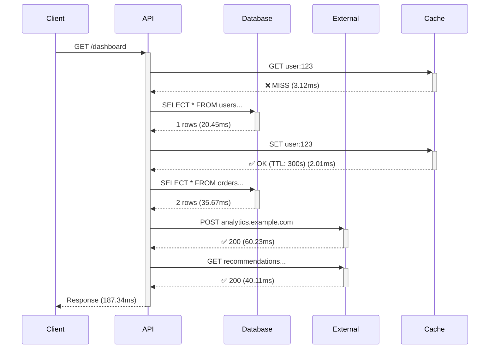

# Flow Visualization Example

**Phase 3.6: Request Flow Visualization**

This example demonstrates RamAPI's request flow tracking and visualization capabilities, showing the complete journey of a request through your application with all dependencies.

## Features Demonstrated

### 1. **Flow Tracking**
- Automatic request lifecycle tracking
- Database query tracking
- HTTP external API call tracking
- Cache operation tracking
- Nested operation tracking with parent-child relationships

### 2. **Visualization Formats**
- **JSON**: Complete flow data for programmatic access
- **ASCII Waterfall**: Terminal-friendly timeline visualization
- **Mermaid Diagrams**: Sequence diagrams for documentation

### 3. **Performance Analysis**
- Bottleneck detection (operations >100ms)
- Slow request identification
- Dependency analysis (DB, HTTP, Cache)
- Cache hit rate tracking
- N+1 query pattern detection

## Running the Example

```bash
# From the project root
npm run dev

# Or with tsx
npx tsx example-app/flow-visualization/server.ts
```

The server will start on `http://localhost:3000`

## Demo Endpoints

### Simple Examples

#### 1. Simple Flow
```bash
curl http://localhost:3000/simple
```
Minimal flow with just routing and response.

#### 2. Database Queries
```bash
curl http://localhost:3000/users
```
Demonstrates database query tracking with multiple queries.

#### 3. HTTP Calls
```bash
curl http://localhost:3000/weather?city=London
```
Shows external API call tracking.

#### 4. Cache Operations
```bash
curl http://localhost:3000/products/123
```
Demonstrates cache miss → DB fetch → cache set pattern.

### Complex Examples

#### 5. Complete Dashboard Flow
```bash
curl http://localhost:3000/dashboard?userId=123
```
**Complex flow demonstrating:**
- Cache check (GET)
- Database query for user
- Cache store (SET)
- Database query for orders
- 2 external HTTP API calls
- Complete dependency chain visualization

#### 6. Slow Endpoint with Bottlenecks
```bash
curl http://localhost:3000/slow-report
```
**Demonstrates:**
- Slow database queries (>100ms)
- Slow external API (>100ms)
- Automatic bottleneck detection
- Performance warnings in visualization

#### 7. N+1 Query Pattern (Anti-pattern)
```bash
curl http://localhost:3000/posts-with-authors
```
**Shows:**
- 1 query for posts
- 5 individual queries for authors (N+1 problem)
- Total: 6 database queries
- Flow visualization clearly shows the problem

#### 8. Optimized Queries
```bash
curl http://localhost:3000/posts-optimized
```
**Shows:**
- 1 query for posts
- 1 bulk query for all authors
- Total: 2 database queries
- Much faster flow

## Visualizing Flows

### Step 1: Generate Traffic
```bash
# Make a request and copy the traceId from response
curl http://localhost:3000/dashboard?userId=123

# Response includes:
# {
#   "message": "Dashboard data fetched",
#   "traceId": "a1b2c3d4e5f6..."
# }
```

### Step 2: Visualize the Flow

#### Get Flow as JSON
```bash
curl http://localhost:3000/profile/<TRACE_ID>/flow | jq
```

#### Get ASCII Waterfall Chart
```bash
# Full waterfall with details
curl http://localhost:3000/profile/<TRACE_ID>/waterfall

# Compact waterfall
curl http://localhost:3000/profile/<TRACE_ID>/waterfall?format=compact

# Custom width
curl http://localhost:3000/profile/<TRACE_ID>/waterfall?width=100
```

**Example Output:**
```
Request Flow Timeline
============================================================
Trace ID: a1b2c3d4e5f6...
Duration: 187.34ms (SLOW)

Timeline (0ms ──────────────────────────────────── 187.34ms)
  ⚡ Request Started              ████████████████████████████████ 187.34ms
  ⚡ Routing                       █ 0.45ms
  💾 GET user:123                 █ 3.12ms (MISS)
  🗄️ SELECT * FROM users...      ███ 20.45ms
  💾 SET user:123                 █ 2.01ms
  🗄️ SELECT * FROM orders...     ████ 35.67ms
  🌐 POST analytics.example.com   ████████ 60.23ms
  🌐 GET recommendations...       █████ 40.11ms
  ⚡ Response Serialization       █ 0.89ms

Dependencies Summary:
  🗄️  Database: 2 queries, 56.12ms total (29.9%)
  🌐 HTTP: 2 calls, 100.34ms total (53.5%)
  💾 Cache: 2 ops, 5.13ms total (2.7%) | Hit rate: 0.0%

⚠️  Bottlenecks Detected:
  - POST analytics.example.com (60.23ms)
  - GET recommendations... (40.11ms)

Performance Insights:
  ⚠️  Dependencies account for 86.2% of request time
  ℹ️  Cache hit rate is low (0.0%)
```

#### Get Mermaid Sequence Diagram
```bash
# Plain Mermaid syntax
curl http://localhost:3000/profile/<TRACE_ID>/mermaid

# Wrapped in markdown code fence
curl http://localhost:3000/profile/<TRACE_ID>/mermaid?markdown=true

# Compact version
curl http://localhost:3000/profile/<TRACE_ID>/mermaid?format=compact

# Without timings
curl http://localhost:3000/profile/<TRACE_ID>/mermaid?includeTimings=false
```

**Example Output:**


#### Smart Format Parameter
```bash
# Use format parameter on main endpoint
curl http://localhost:3000/profile/<TRACE_ID>?format=json
curl http://localhost:3000/profile/<TRACE_ID>?format=waterfall
curl http://localhost:3000/profile/<TRACE_ID>?format=mermaid
curl http://localhost:3000/profile/<TRACE_ID>?format=markdown
```

## Flow Analytics Endpoints

### Get Flow Statistics
```bash
curl http://localhost:3000/flow/stats
```

**Response:**
```
Flow Statistics
============================================================
Total Flows: 15
Slow Flows: 3 (20.0%)
Flows with Bottlenecks: 4

Duration Metrics:
  Average: 145.67ms
  P50: 98.45ms
  P95: 287.23ms
  P99: 345.12ms

Dependencies:
  Database Calls: 47
  HTTP Calls: 18
  Cache Operations: 23
  Cache Hit Rate: 34.8%

Common Bottlenecks:
  1. SELECT * FROM analytics_events... (3 occurrences)
  2. POST analytics.example.com (2 occurrences)
```

### Get Slowest Flows
```bash
curl http://localhost:3000/flow/slow?limit=5
```

### Get Flows with Bottlenecks
```bash
curl http://localhost:3000/flow/bottlenecks?limit=5
```

### List All Flows with Filtering
```bash
# All flows
curl http://localhost:3000/flow/list

# Only slow flows
curl http://localhost:3000/flow/list?slow=true

# Flows with database queries
curl http://localhost:3000/flow/list?hasDependency=database

# Flows with bottlenecks
curl http://localhost:3000/flow/list?hasBottlenecks=true

# Duration range
curl http://localhost:3000/flow/list?minDuration=100&maxDuration=500

# Pagination
curl http://localhost:3000/flow/list?limit=10&offset=0

# JSON format
curl http://localhost:3000/flow/list?format=json
```

## Use Cases

### 1. Debugging Performance Issues
```bash
# 1. Find slow requests
curl http://localhost:3000/flow/slow

# 2. Get detailed waterfall for investigation
curl http://localhost:3000/profile/<TRACE_ID>/waterfall
```

### 2. Identifying N+1 Queries
```bash
# Generate N+1 pattern
curl http://localhost:3000/posts-with-authors

# Visualize - you'll see multiple individual DB queries
curl http://localhost:3000/profile/<TRACE_ID>/waterfall

# Compare with optimized version
curl http://localhost:3000/posts-optimized
curl http://localhost:3000/profile/<TRACE_ID>/waterfall
```

### 3. Cache Efficiency Analysis
```bash
# First call (cache miss)
curl http://localhost:3000/products/1

# Check flow stats for cache hit rate
curl http://localhost:3000/flow/stats
```

### 4. Dependency Analysis
```bash
# List flows by dependency type
curl http://localhost:3000/flow/list?hasDependency=database
curl http://localhost:3000/flow/list?hasDependency=http
curl http://localhost:3000/flow/list?hasDependency=cache
```

### 5. Documentation Generation
```bash
# Generate Mermaid diagrams for your API documentation
curl http://localhost:3000/profile/<TRACE_ID>/mermaid?markdown=true > flow-diagram.md

# Include in your README or docs
# The Mermaid diagram will render automatically in GitHub
```

## Integration Tips

### In Your Application

```typescript
import { flowTrackingMiddleware, trackDatabase, trackHTTP, trackCache } from 'ramapi';

// Enable flow tracking
app.use(flowTrackingMiddleware());

// Track database queries
const users = await trackDatabase(
  ctx,
  'SELECT * FROM users',
  async () => db.query('SELECT * FROM users'),
  { database: 'postgres' }
);

// Track HTTP calls
const data = await trackHTTP(
  ctx,
  'GET',
  'https://api.example.com/data',
  async () => fetch('https://api.example.com/data').then(r => r.json())
);

// Track cache operations
const cached = await trackCache(
  ctx,
  'get',
  'my-key',
  async () => redis.get('my-key')
);
```

### Accessing Flow Data

```typescript
import { getRequestFlow } from 'ramapi';

// At the end of your handler
const flow = getRequestFlow(ctx);
if (flow) {
  console.log(`Request took ${flow.stats.totalDuration}ms`);
  console.log(`Database calls: ${flow.stats.databaseCalls}`);
  console.log(`Bottlenecks: ${flow.bottlenecks.join(', ')}`);
}
```

## What's Next?

After exploring flow visualization:
- Try the profiling example (`example-app/profiling/server.ts`)
- Explore tracing with OpenTelemetry (`example-app/observability/server.ts`)
- Check out the multi-protocol example (`example-app/multi-protocol/server.ts`)

## Learn More

- [RamAPI Documentation](../../README.md)
- [Phase 3.6: Flow Visualization](../../docs/phase-3.6-flow-visualization.md)
- [Observability Guide](../../docs/observability.md)
