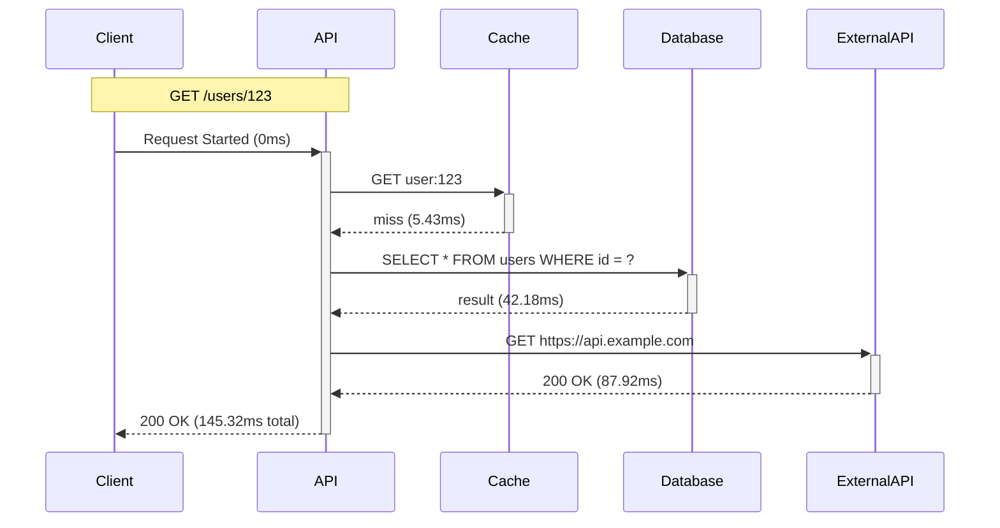

# Flow Visualization Examples

This directory contains practical examples demonstrating RamAPI's Request Flow Visualization feature.

## Examples

### 1. Basic Flow (`basic-flow.ts`)

**What it demonstrates:**
- Setting up flow tracking middleware
- Automatic lifecycle event tracking
- Viewing flow visualizations

**Run it:**
```bash
npx tsx examples/flow-visualization/basic-flow.ts
```

**Try it:**
```bash
# Make a request
curl http://localhost:3000/

# Copy the traceId from response, then view the flow
curl http://localhost:3000/profile/{traceId}/waterfall
```

---

### 2. Database Tracking (`database-tracking.ts`)

**What it demonstrates:**
- Tracking single database queries
- Sequential vs parallel query execution
- Query sanitization for sensitive data
- Bottleneck detection for slow queries

**Run it:**
```bash
npx tsx examples/flow-visualization/database-tracking.ts
```

**Try it:**
```bash
# Single query
curl http://localhost:3001/users/1

# Multiple sequential queries
curl http://localhost:3001/users/1/posts

# Multiple parallel queries (faster!)
curl http://localhost:3001/dashboard

# Slow query (bottleneck detection)
curl http://localhost:3001/reports/slow

# View the flow
curl http://localhost:3001/profile/{traceId}/waterfall
```

---

### 3. HTTP Tracking (`http-tracking.ts`)

**What it demonstrates:**
- Tracking external API calls
- Sequential vs parallel HTTP requests
- Error handling in tracked calls
- Performance comparison

**Run it:**
```bash
npx tsx examples/flow-visualization/http-tracking.ts
```

**Try it:**
```bash
# Single HTTP call
curl http://localhost:3002/profile/123

# Sequential HTTP calls
curl http://localhost:3002/user-dashboard/123

# Parallel HTTP calls (faster!)
curl http://localhost:3002/aggregate/123

# Compare the flows to see the performance difference
curl http://localhost:3002/profile/{traceId}/waterfall
```

---

### 4. Cache Tracking (`cache-tracking.ts`)

**What it demonstrates:**
- Cache-aside pattern
- Cache hit/miss tracking
- Cache invalidation
- Batch cache operations
- Cache hit rate statistics

**Run it:**
```bash
npx tsx examples/flow-visualization/cache-tracking.ts
```

**Try it:**
```bash
# First request - cache miss
curl http://localhost:3003/users/1
# Copy traceId and view flow (shows DB query + cache SET)
curl http://localhost:3003/profile/{traceId}/waterfall

# Second request - cache hit (much faster!)
curl http://localhost:3003/users/1
# View flow (shows only cache GET with hit=true)
curl http://localhost:3003/profile/{traceId}/waterfall

# Check cache hit rate
curl http://localhost:3003/flow/stats | grep cacheHitRate
```

---

### 5. Complex Flow (`complex-flow.ts`)

**What it demonstrates:**
- Real-world application flow
- Multiple dependencies (cache + database + HTTP)
- Parallel execution for performance
- E-commerce checkout flow
- Analytics with complex queries

**Run it:**
```bash
npx tsx examples/flow-visualization/complex-flow.ts
```

**Try it:**
```bash
# Complex dashboard endpoint
curl http://localhost:3004/users/1/dashboard

# View the complete flow
curl http://localhost:3004/profile/{traceId}/waterfall
curl http://localhost:3004/profile/{traceId}/mermaid

# E-commerce checkout
curl -X POST http://localhost:3004/checkout \
  -H "Content-Type: application/json" \
  -d '{"userId": "1", "items": [1, 2, 3]}'

# Analytics report (with bottlenecks)
curl http://localhost:3004/analytics/report

# View slowest requests
curl http://localhost:3004/flow/slow
```

---

## Visualization Formats

### ASCII Waterfall Chart

Visual timeline showing all operations:

```bash
curl http://localhost:3000/profile/{traceId}/waterfall
```

**Output:**
```
Request Flow Timeline (145.32ms total)
════════════════════════════════════════════════════════════════════════════════

Request:      GET /users/123
Trace ID:     a1b2c3d4e5f6...
Duration:     145.32ms
Status:       ✓ OK

Timeline:
0ms         36ms        73ms        109ms       145ms
|-----------|-----------|-----------|-----------|
⚡ Request Started                                    3.21ms
💾 Cache: GET user:123                               5.43ms
🗄️ DB: SELECT * FROM users WHERE id = ?             42.18ms  ⚠️
🌐 HTTP: GET https://api.example.com/profiles        87.92ms  ⚠️
⚡ Response Serialization                             2.11ms
```

### Mermaid Sequence Diagram

Generate diagrams for documentation:

```bash
curl http://localhost:3000/profile/{traceId}/mermaid
```

**Output:**


### JSON Data

Raw flow data for programmatic access:

```bash
curl http://localhost:3000/profile/{traceId}/flow
```

---

## Common Patterns

### 1. Cache-Aside Pattern

```typescript
// Check cache first
const cached = await trackCache(ctx, 'get', key, async () => cache.get(key));

if (cached) {
  return ctx.json(cached);
}

// Cache miss - fetch from DB
const data = await trackDatabase(ctx, 'SELECT ...', async () => db.query('...'));

// Store in cache
await trackCache(ctx, 'set', key, async () => cache.set(key, data), { ttl: 3600 });

ctx.json(data);
```

### 2. Parallel Execution

```typescript
// Sequential (slow)
const user = await trackDatabase(ctx, 'SELECT * FROM users', ...);
const posts = await trackDatabase(ctx, 'SELECT * FROM posts', ...);
const comments = await trackDatabase(ctx, 'SELECT * FROM comments', ...);

// Parallel (fast!)
const [user, posts, comments] = await Promise.all([
  trackDatabase(ctx, 'SELECT * FROM users', ...),
  trackDatabase(ctx, 'SELECT * FROM posts', ...),
  trackDatabase(ctx, 'SELECT * FROM comments', ...),
]);
```

### 3. Error Handling

```typescript
try {
  const data = await trackHTTP(ctx, 'GET', url, async () => {
    const response = await fetch(url);
    if (!response.ok) throw new Error(`HTTP ${response.status}`);
    return response.json();
  });
} catch (error) {
  // Error is automatically tracked in the flow
  ctx.json({ error: 'API call failed' }, 500);
}
```

---

## API Endpoints

All examples expose these endpoints for viewing flows:

- `GET /profile/:traceId/flow` - Get flow data as JSON
- `GET /profile/:traceId/waterfall` - Get ASCII waterfall visualization
- `GET /profile/:traceId/mermaid` - Get Mermaid sequence diagram
- `GET /profile/:traceId?format=json|waterfall|mermaid` - Get flow in specified format
- `GET /flow/stats` - Get statistics about all flows
- `GET /flow/slow` - Get slowest requests

---

## Tips

1. **Enable tracing** - Flow tracking requires OpenTelemetry tracing to be enabled
2. **Track all dependencies** - Wrap database queries, HTTP calls, and cache operations
3. **Use parallel execution** - Use `Promise.all()` for independent operations
4. **Monitor cache hit rate** - Check `/flow/stats` for cache performance
5. **Identify bottlenecks** - Look for ⚠️ warnings in waterfall charts
6. **Compare flows** - Run the same endpoint twice to see cache vs database performance

---

## Performance Comparison

Run these examples to see the performance impact:

```bash
# Sequential execution (slower)
curl http://localhost:3002/user-dashboard/123

# Parallel execution (faster)
curl http://localhost:3002/aggregate/123

# Compare the waterfall charts
curl http://localhost:3002/profile/{traceId}/waterfall
```

---

## Troubleshooting

**Flow not found?**
- Check that tracing is enabled in app config
- Verify `flowTrackingMiddleware()` is registered
- Ensure the traceId is correct

**Missing dependencies?**
- Wrap operations with tracking utilities
- Verify tracking utilities are called within request context
- Check that `ctx` parameter is passed correctly

---

For more information, see the [Flow Visualization Guide](../../docs/FLOW_VISUALIZATION.md).
